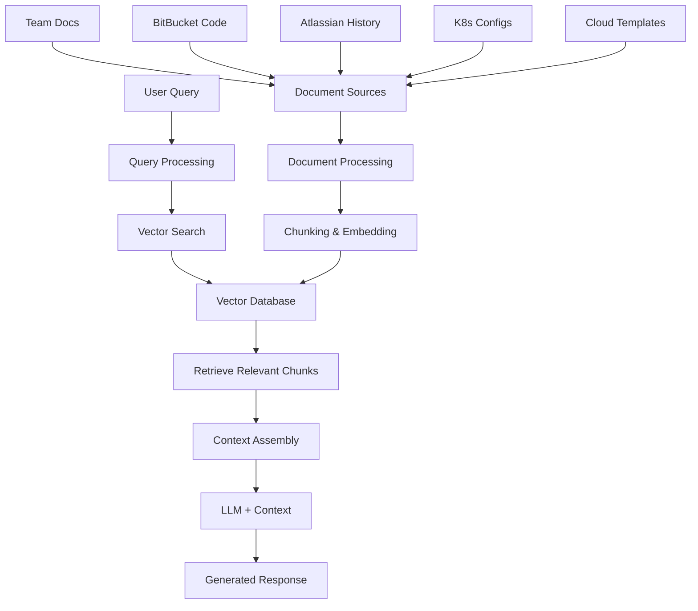

# RAG Architecture for NinjaBot

## Overview

This document explains how Retrieval-Augmented Generation (RAG) will be implemented in the NinjaBot to provide intelligent, context-aware responses based on the Cloud Ninja Team's knowledge base.

## What is RAG?

RAG (Retrieval-Augmented Generation) is an AI architecture that combines:

- **Retrieval**: Finding relevant information from a knowledge base
- **Generation**: Using an LLM to create responses based on retrieved context

Unlike model fine-tuning, RAG doesn't retrain the model. Instead, it provides relevant context at query time.

## RAG vs Model Training Comparison

| Aspect              | RAG                                             | Model Training/Fine-tuning             |
| ------------------- | ----------------------------------------------- | -------------------------------------- |
| **Implementation**  | Store docs in vector DB, retrieve at query time | Retrain model weights with custom data |
| **Cost**            | Low - no GPU training required                  | High - requires significant compute    |
| **Speed to Deploy** | Fast - hours to days                            | Slow - weeks to months                 |
| **Updates**         | Real-time - add docs instantly                  | Requires full retraining cycle         |
| **Accuracy**        | High for domain-specific queries                | Can be high but knowledge gets "stale" |
| **Maintenance**     | Easy - just update document store               | Complex - manage training pipelines    |

## Why RAG is Perfect for NinjaBot

### 1. Dynamic Knowledge Base

- Team documentation changes frequently
- Code repositories evolve daily
- New cloud patterns and practices emerge
- RAG allows instant knowledge updates without retraining

### 2. Multi-Source Integration

- Working documents (Confluence, SharePoint, etc.)
- BitBucket repositories and code patterns
- Historical Atlassian tickets and resolutions
- K8s/ArgoCD configuration examples
- Cloud provider best practices

### 3. Cost-Effective Scaling

- No expensive GPU training required
- Can start small and scale the knowledge base
- Pay-per-query model vs upfront training costs

## NinjaBot RAG Architecture



## Implementation Components

### 1. Document Ingestion Pipeline

```
Raw Documents → Text Extraction → Chunking → Embedding → Vector Storage
```

**Sources:**

- Confluence/SharePoint documentation
- BitBucket repositories (README, code comments, config files)
- Atlassian ticket history and resolutions
- Kubernetes manifests and Helm charts
- Terraform/CloudFormation templates
- Team runbooks and procedures

### 2. Vector Database Options

- **Cloud Solutions**: Pinecone, Weaviate Cloud
- **Self-Hosted**: Weaviate, Qdrant, Milvus
- **Local Development**: ChromaDB, FAISS

### 3. Embedding Models

- **OpenAI**: text-embedding-ada-002 (good general purpose)
- **Open Source**: sentence-transformers models
- **Code-Specific**: CodeBERT for code understanding

### 4. Retrieval Strategy

- **Semantic Search**: Find conceptually similar content
- **Hybrid Search**: Combine semantic + keyword search
- **Metadata Filtering**: Filter by source, date, team, etc.

## RAG Workflow for NinjaBot Use Cases

### Document Questions

```
User: "What's our deployment process for microservices?"
→ Retrieve: Deployment runbooks, K8s configs, team procedures
→ Context: Relevant documentation chunks
→ Response: Step-by-step process with team-specific details
```

### Code Recommendations

```
User: "How should I structure a new API service?"
→ Retrieve: Existing API code patterns, architecture docs
→ Context: Team's coding standards and examples
→ Response: Recommendations based on team's actual patterns
```

### Troubleshooting

```
User: "Pod is failing to start in staging"
→ Retrieve: Similar past issues, troubleshooting guides
→ Context: Historical solutions and debugging steps
→ Response: Targeted troubleshooting based on team experience
```

## Technical Implementation Details

### Chunking Strategy

- **Size**: 500-1000 tokens per chunk
- **Overlap**: 50-100 tokens between chunks
- **Boundaries**: Respect document structure (headers, code blocks)

### Metadata Enrichment

```json
{
  "content": "chunk text",
  "source": "confluence/bitbucket/atlassian",
  "team": "cloud-ninja",
  "type": "documentation/code/ticket",
  "last_updated": "2024-01-15",
  "tags": ["kubernetes", "deployment", "troubleshooting"]
}
```

### Query Enhancement

- **Intent Detection**: Classify query type (how-to, troubleshooting, code example)
- **Query Expansion**: Add synonyms and related terms
- **Context Filtering**: Use conversation history for better retrieval

## Integration with NinjaBot Features

### Atlassian Ticket Creation

- Retrieve similar past tickets for better categorization
- Use historical resolutions to suggest initial approaches
- Auto-populate ticket fields based on context patterns

### K8s/ArgoCD Operations

- Retrieve relevant configuration examples
- Reference team's deployment patterns
- Provide context-aware troubleshooting steps

### Custom MCP Operations

- Use team's cloud resource templates
- Reference security and compliance patterns
- Provide organization-specific best practices

## Performance Considerations

### Retrieval Optimization

- **Indexing**: Pre-compute embeddings for faster search
- **Caching**: Cache frequent queries and results
- **Filtering**: Use metadata to narrow search space

### Response Quality

- **Relevance Scoring**: Rank retrieved chunks by relevance
- **Context Window**: Optimize chunk selection for LLM context limits
- **Source Attribution**: Always cite sources in responses

## Monitoring and Maintenance

### Quality Metrics

- **Retrieval Accuracy**: Are the right documents being found?
- **Response Relevance**: Do responses address the user's question?
- **Source Coverage**: Is the knowledge base comprehensive?

### Continuous Improvement

- **Feedback Loop**: Learn from user interactions
- **Knowledge Gaps**: Identify missing information
- **Update Frequency**: Monitor document freshness

## How RAG Interfaces with the LLM

### The RAG-LLM Integration Process

RAG doesn't modify the LLM itself. Instead, it dynamically injects relevant context into the prompt before sending it to the LLM. Here's exactly how it works:

#### Step-by-Step RAG Flow

1. **User Query Received**

   ```
   User: "How do I deploy a new microservice to our staging environment?"
   ```

2. **Query Embedding**

   - Convert user query to vector embedding
   - Use same embedding model used for documents

3. **Vector Search**

   - Search vector database for similar content
   - Return top 3-5 most relevant chunks with similarity scores

4. **Context Assembly**

   - Retrieve the actual text content from matched chunks
   - Rank by relevance and recency
   - Format for LLM consumption

5. **Prompt Construction**

   - Combine retrieved context with user query
   - Add system instructions and formatting

6. **LLM Request**
   - Send enhanced prompt to LLM (GPT-4, Claude, etc.)
   - LLM generates response using both its training and the retrieved context

### Detailed Example: RAG Flow in Action

#### User Query

```
"How do I deploy a new microservice to our staging environment?"
```

#### Retrieved Context (from vector search)

```
Document 1: deployment-guide.md (similarity: 0.89)
"For staging deployments, always use the staging namespace.
Run: kubectl apply -f deployment.yaml -n staging
Ensure your service has the staging-ready label."

Document 2: microservice-template.yaml (similarity: 0.85)
"apiVersion: apps/v1
kind: Deployment
metadata:
  name: my-service
  namespace: staging
spec:
  replicas: 2
  selector:
    matchLabels:
      app: my-service
      env: staging"

Document 3: team-runbook.md (similarity: 0.82)
"Before deploying to staging:
1. Run tests locally
2. Check ArgoCD sync status
3. Verify staging database connections
4. Deploy during business hours only"
```

#### Constructed Prompt to LLM

```
System: You are NinjaBot, an assistant for the Cloud Ninja team.
Use the provided context to answer questions about team processes and code.

Context from team documentation:
---
[Document: deployment-guide.md]
For staging deployments, always use the staging namespace.
Run: kubectl apply -f deployment.yaml -n staging
Ensure your service has the staging-ready label.

[Document: microservice-template.yaml]
apiVersion: apps/v1
kind: Deployment
metadata:
  name: my-service
  namespace: staging
spec:
  replicas: 2
  selector:
    matchLabels:
      app: my-service
      env: staging

[Document: team-runbook.md]
Before deploying to staging:
1. Run tests locally
2. Check ArgoCD sync status
3. Verify staging database connections
4. Deploy during business hours only
---

User Question: How do I deploy a new microservice to our staging environment?

Please provide a step-by-step answer based on our team's documented processes.
```

#### LLM Response

```
Based on your team's deployment guide, here's how to deploy a new microservice to staging:

**Pre-deployment Checklist:**
1. Run tests locally first
2. Check ArgoCD sync status
3. Verify staging database connections
4. Ensure you're deploying during business hours

**Deployment Steps:**
1. Use the staging namespace: `kubectl apply -f deployment.yaml -n staging`
2. Ensure your service has the `staging-ready` label
3. Set replicas to 2 for staging (as per your template)
4. Use the env: staging label in your deployment spec

**Template Reference:**
Your deployment should follow the team template with namespace: staging
and appropriate labels for the staging environment.

Would you like me to help you create the specific deployment.yaml for your service?
```

### Technical Implementation Details

#### Prompt Template Structure

```python
def construct_rag_prompt(user_query, retrieved_chunks, conversation_history=None):
    system_prompt = """
    You are NinjaBot, an AI assistant for the Cloud Ninja team.
    Use the provided context from team documentation to answer questions.
    Always cite which document you're referencing.
    If the context doesn't contain relevant information, say so clearly.
    """

    context_section = ""
    for chunk in retrieved_chunks:
        context_section += f"""
        [Document: {chunk.source}]
        {chunk.content}

        """

    full_prompt = f"""
    {system_prompt}

    Context from team documentation:
    ---
    {context_section}
    ---

    {conversation_history if conversation_history else ""}

    User Question: {user_query}

    Please provide a helpful answer based on the team's documented processes.
    """

    return full_prompt
```

#### Context Window Management

- **Token Limits**: Most LLMs have context limits (4K, 8K, 32K tokens)
- **Smart Truncation**: Prioritize most relevant chunks if context is too large
- **Chunk Ranking**: Use similarity scores + recency + source authority

#### Example Context Prioritization

```python
def select_best_chunks(chunks, max_tokens=6000):
    # Sort by relevance score
    chunks.sort(key=lambda x: x.similarity_score, reverse=True)

    selected_chunks = []
    total_tokens = 0

    for chunk in chunks:
        chunk_tokens = estimate_tokens(chunk.content)
        if total_tokens + chunk_tokens <= max_tokens:
            selected_chunks.append(chunk)
            total_tokens += chunk_tokens
        else:
            break

    return selected_chunks
```

### RAG Response Quality Factors

#### What Makes RAG Effective

1. **Relevant Retrieval**: Finding the right documents
2. **Good Chunking**: Preserving context in document pieces
3. **Clear Prompt Structure**: Helping LLM understand how to use context
4. **Source Attribution**: Letting users verify information

#### Common RAG Challenges

- **Irrelevant Retrieval**: Wrong documents found
- **Context Overflow**: Too much information for LLM
- **Chunk Boundaries**: Important info split across chunks
- **Outdated Information**: Old documents ranked higher

### Monitoring RAG Performance

#### Key Metrics to Track

```python
# Retrieval Quality
retrieval_metrics = {
    "avg_similarity_score": 0.85,
    "chunks_used_per_query": 3.2,
    "source_diversity": 0.7,  # Different sources used
}

# Response Quality
response_metrics = {
    "user_satisfaction": 4.2,  # 1-5 scale
    "source_citation_rate": 0.9,  # How often sources are cited
    "followup_question_rate": 0.3,  # Lower is better
}
```

This RAG-LLM interface ensures that your NinjaBot always has access to your team's latest knowledge while maintaining the conversational abilities of modern LLMs.

## Security and Privacy

### Access Control

- Respect existing document permissions
- Filter results based on user access levels
- Audit retrieval and generation logs

### Data Handling

- Secure vector storage
- Encrypted embeddings
- Compliance with data retention policies

## Getting Started

### Phase 1: Core Documentation

- Ingest team runbooks and procedures
- Add key BitBucket repositories
- Basic Q&A functionality

### Phase 2: Code Intelligence

- Expand to all repositories
- Add code pattern recognition
- Integrate with development workflows

### Phase 3: Full Integration

- Historical ticket analysis
- Advanced troubleshooting
- Predictive recommendations

This RAG architecture will make NinjaBot truly intelligent about your team's specific knowledge, practices, and codebase while remaining cost-effective and maintainable.
